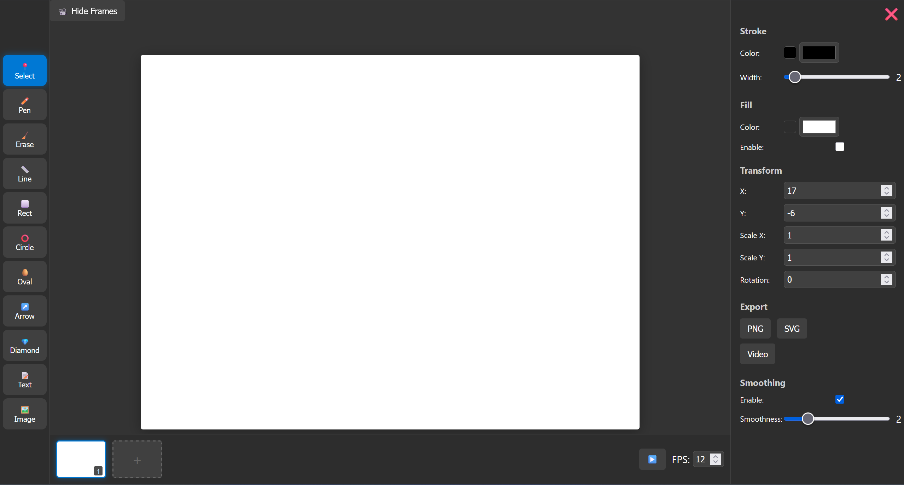
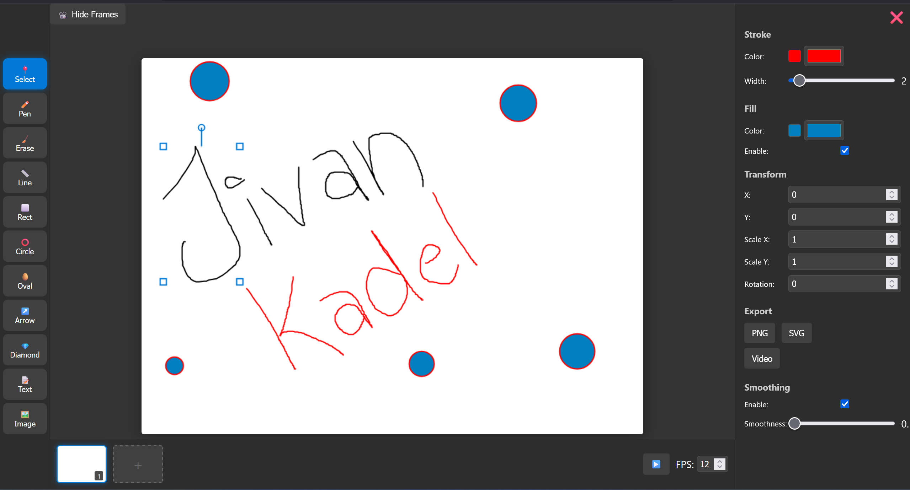
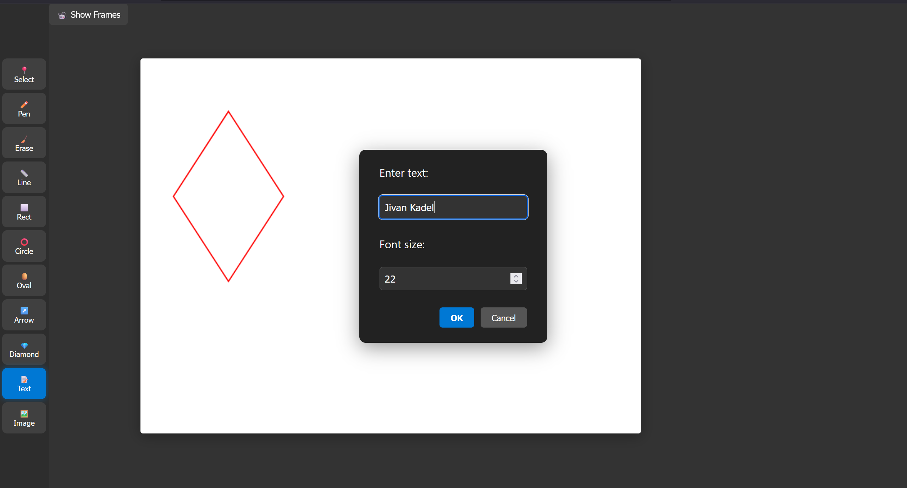
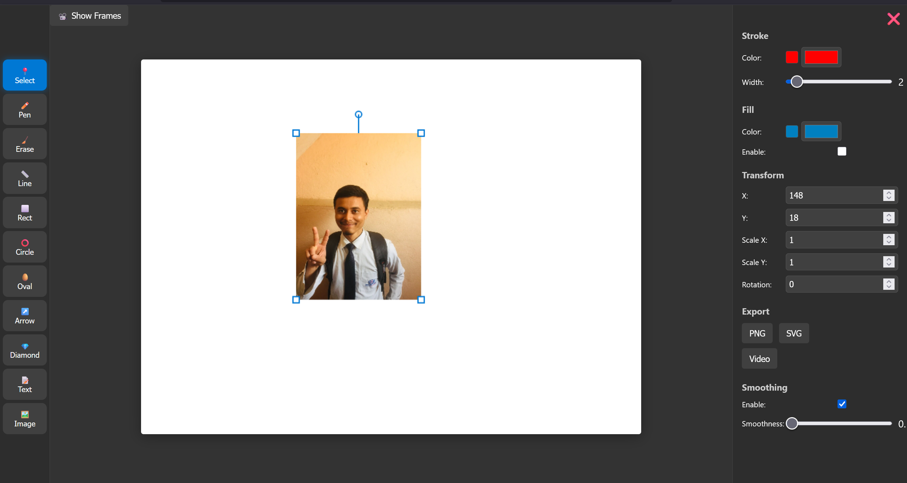
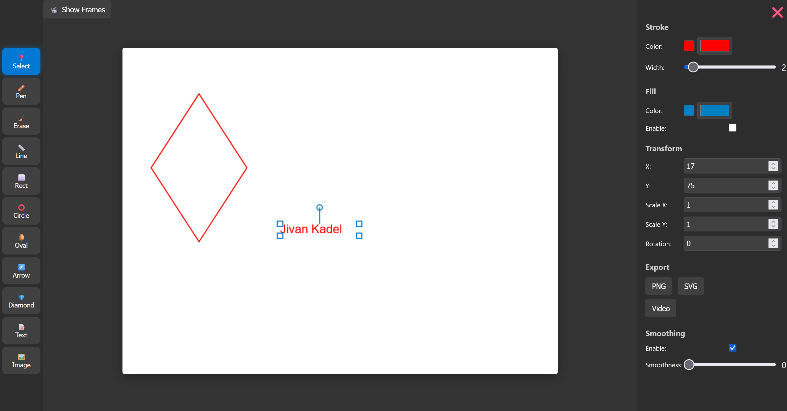
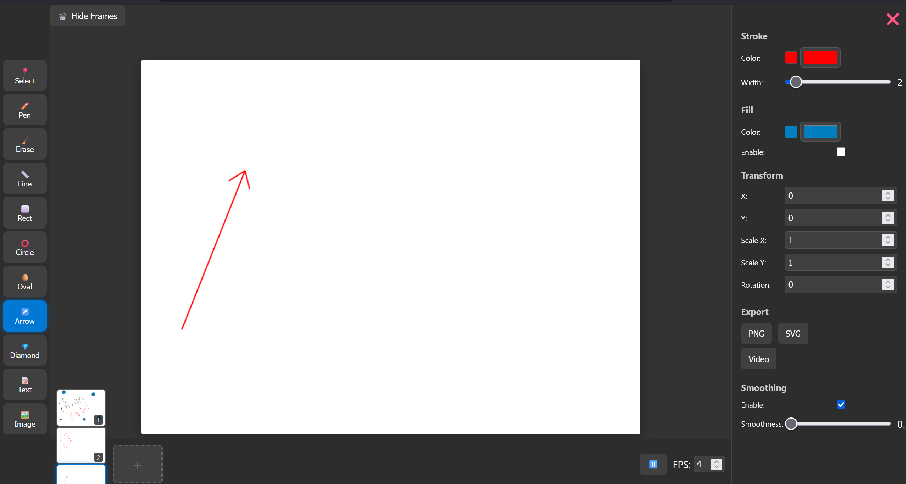

# SketchMotion

# ---UNDER DEVELOPMENT---

**SketchMotion** is a modern drawing and sketching app, **currently under active development**. It empowers users to create, animate, and export sketches with ease, leveraging the latest web technologies.

---

## Features

- **Draw Shapes:** Line, arrow, rectangle, oval, and circle tools.

- **Freehand Drawing:** Smooth your strokes using the [Douglas-Peucker Algorithm](https://en.wikipedia.org/wiki/Ramer–Douglas–Peucker_algorithm).

- **Add Text & Images:** Insert and position text or images on your canvas.

- **Select & Move:** Easily select and reposition objects.

- **Transformations:** Rotate, scale, and skew objects _(under development)_.

- **Frames & Animation:** Add frames, adjust frame rates, and preview frame-by-frame animations.

- **Export Options:** Save your work as SVG, PNG, Webm, and mp4.

---

## Screenshots

- App Overview

  

- Draw shapes, stroke, fill

  

- Add text(s)

  

- Add image(s)

  

- Select and move objects

  

- Frame by frame animation

  

---

---

**Under Development**

- Export frame (svg, png), frames (mp4, webm)

- Scale, rotate, skew objects

- Delete, clone frame

- Redo / Undo

- Copy Paste objects

---

---

## 🚀 Getting Started

1. **Clone the repository:**

   ```bash
   git clone https://github.com/yourusername/SketchMotion.git
   cd SketchMotion
   ```

2. **Open in your browser:**

   - Simply open `index.html` in your preferred browser.

3. **(Optional) For development:**

   - Install dependencies and run a local server:

     ```bash
     npm install
     npm start
     ```

---

## Tech Stack

- **HTML5 & Canvas**
- **CSS**
- **JavaScript** (initially TypeScript)

---

## Roadmap

- [x] Basic shape drawing
- [x] Freehand smoothing
- [x] Canvas zoom & pan
- [x] Animation Preview
- [x] Export frame (png), frames (webm)
- [ ] Export SVG, mp4
- [ ] Object transformations (rotate, scale, skew)
- [ ] Advanced animation tools

---

## 📚 Learn More

- [Douglas-Peucker Algorithm](https://en.wikipedia.org/wiki/Ramer–Douglas–Peucker_algorithm)

- [Geometric Transformations (Rotation, Scaling, Translation, Skewing)](https://en.wikipedia.org/wiki/Transformation_matrix)

- [Basic Animation Principles](https://en.wikipedia.org/wiki/12_basic_principles_of_animation)

- [Bounding Box Algorithm for Selection](https://en.wikipedia.org/wiki/Minimum_bounding_box)

- [HTML5 Canvas Documentation (MDN)](https://developer.mozilla.org/en-US/docs/Web/API/Canvas_API)

- [Frame-by-Frame Animation](https://en.wikipedia.org/wiki/Frame_animation)

- [Window to Viewport Transformation](<https://en.wikipedia.org/wiki/Viewport_(computer_graphics)#Window-to-viewport_transformation>)

---

## Status

> **Note:** This project is under active development. Features and UI may change frequently.

---

> **All suggestions and feedbacks are highly welcome**

---

## License

You are free to do as you please with the code. MIT (probably).

---

_Happy sketching!_
